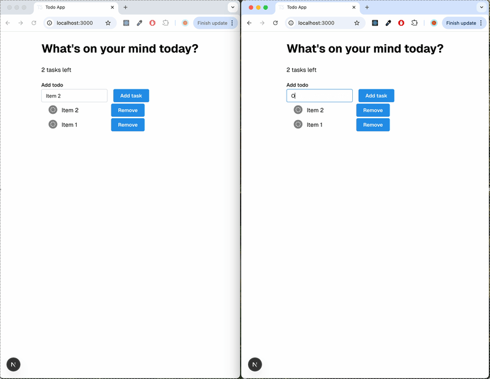
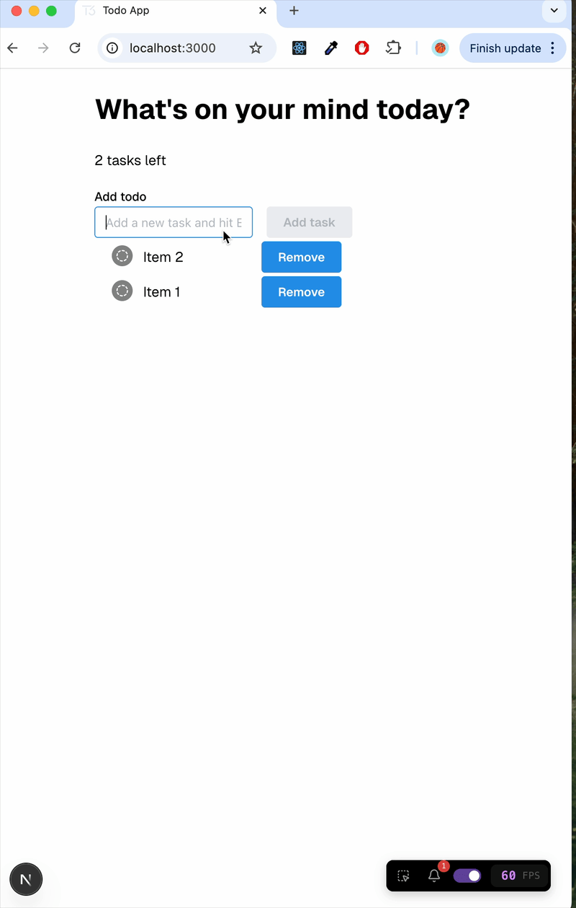

# Welcome! Isak's Network Optimized Todo List

## Features

1. Optimized Real Time Sync Behavior
   - Enabled using minimal helper method that combines event emitter listeners.
   - The result: Single SSE connection to handle multiple event types in a reducer-like fashion, reducing overhead.
2. Optional re-render debugging with React Scan.
   - An excellent tool for performance optimization. In this example, the list and form components can have respective parent components that handle async logic, thereby separating asynchronous state updates and isolating re-renders in response to data changes.

   Example:

   ```jsx
   <Todos form={<TodoForm/>}> // Ensures isolation when list re-renders.
   ```

   or, following patterns of Compound components:

   ```jsx
   <Todos>
      <Todos.Form>
      <Todos.List>
   </Todos>
   ```

## Demos:

#### Real Time Sync



#### React Scan Re-render Optimization (Changes to the Todo List no longer affect Todo Form)



## Development Setup

Using `node v20` and `docker`:

0. `docker compose up -d`
1. `npm i`
2. `npx prisma migrate dev`
3. `npm run dev`
